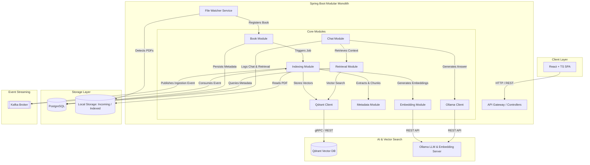
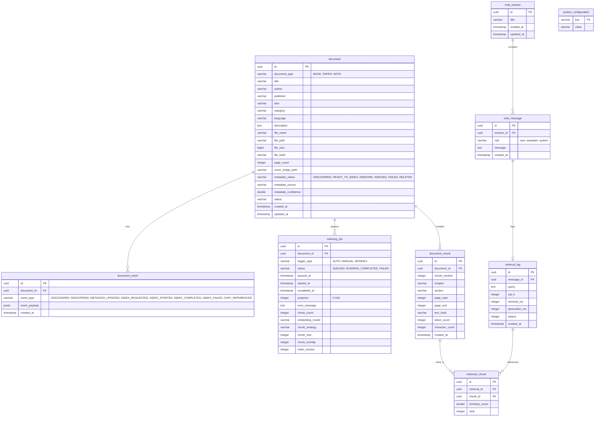
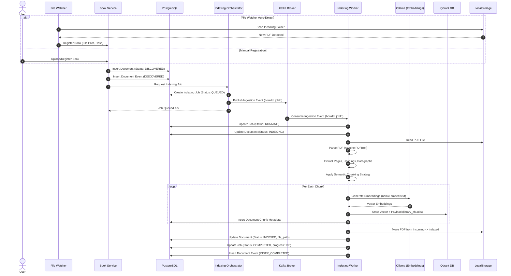
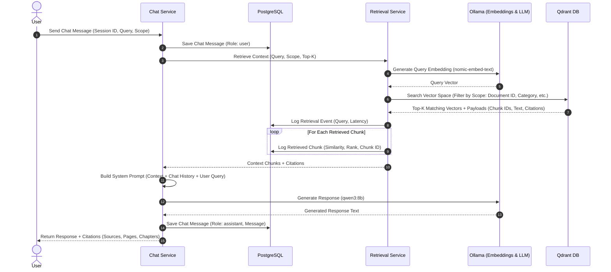

# Pustakalay.ai - System Architecture & Design Specification

This document details the architecture, database schema, sequence diagrams, and chunking strategy for **Pustakalay.ai**, a production-inspired Personal Knowledge Platform.

---

## 1. Architecture Diagram

The system is designed as a modular monolith in Spring Boot, communicating with external services (PostgreSQL, Kafka, Qdrant, Ollama) and serving a React + TypeScript frontend.

---

## 2. Database Schema (ER Diagram)

The database schema is designed to support complete traceability, job progress tracking, chat history, retrieval analytics, and configuration management.

---

## 3. Sequence Diagrams

### 3.1 Book Registration and Indexing (Asynchronous Pipeline)

### 3.2 Chat Query Execution (Retrieval-Augmented Generation)

---

## 4. Hierarchical Semantic Chunking Strategy

To ensure high-quality retrieval, we implement a **Hierarchical Semantic Chunker**:

1. **Document Parsing**: Extract text while preserving page boundaries and structure.
2. **Heading & Section Detection**: Identify chapters and section headers using font size, style, or regex patterns.
3. **Paragraph Aggregation**: Group sentences into paragraphs. Paragraphs act as the atomic units of text.
4. **Semantic Chunk Assembly**:
   - Accumulate paragraphs into a chunk until the target size (e.g., 600 tokens) is reached.
   - Maintain a sliding window overlap (e.g., 100 tokens) by prepending paragraphs from the end of the previous chunk.
   - Never split a paragraph across chunks unless it exceeds the maximum chunk size.
5. **Metadata Enrichment**: Each chunk is tagged with its document ID, title, author, category, chapter, section, page range, paragraph range, chunk index, and index version. This metadata is stored in both Qdrant (payload) and PostgreSQL (`document_chunk` table) to enable precise filtering and citations.
